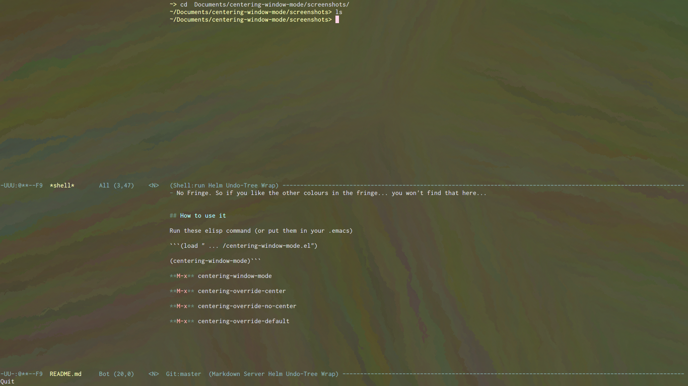
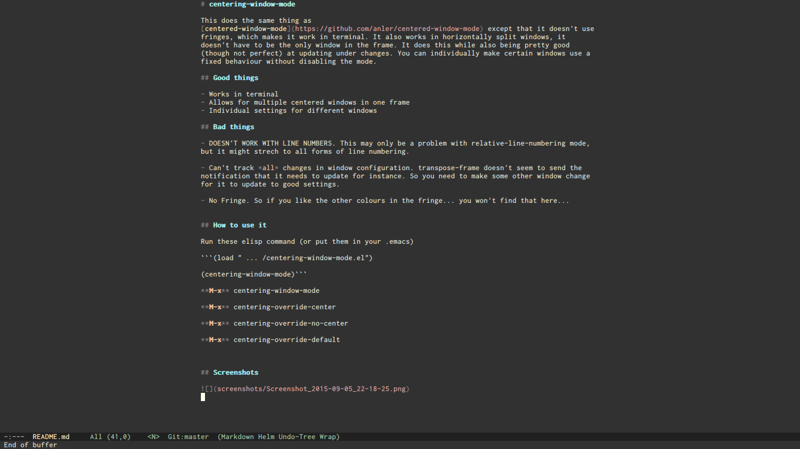

# centering-window-mode

This does the same thing as [centered-window-mode](https://github.com/anler/centered-window-mode) except that it doesn't use fringes, which makes it work in terminal. It also works in horizontally split windows, it doesn't have to be the only window in the frame. It does this while also being pretty good (though not perfect) at updating under changes. You can individually make certain windows use a fixed behaviour without disabling the mode.

## Good things

- Works in terminal
- Allows for multiple centered windows in one frame
- Individual settings for different windows

## Bad things

- DOESN'T WORK WITH LINE NUMBERS. This may only be a problem with relative-line-numbering mode, but it might strech to all forms of line numbering.

- Can't track *all* changes in window configuration. transpose-frame doesn't seem to send the notification that it needs to update for instance. So you need to make some other window change for it to update to good settings.

- No Fringe. So if you like the other colours in the fringe... you won't find that here...


## How to use it

Run these elisp command (or put them in your .emacs)

```(load " ... /centering-window-mode.el")

(centering-window-mode)```

**M-x** centering-window-mode

**M-x** centering-override-center

**M-x** centering-override-no-center

**M-x** centering-override-default


## Screenshots



